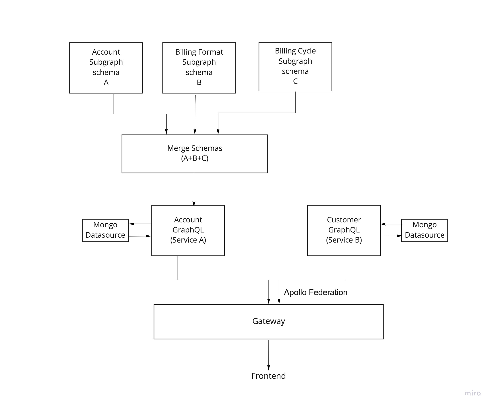
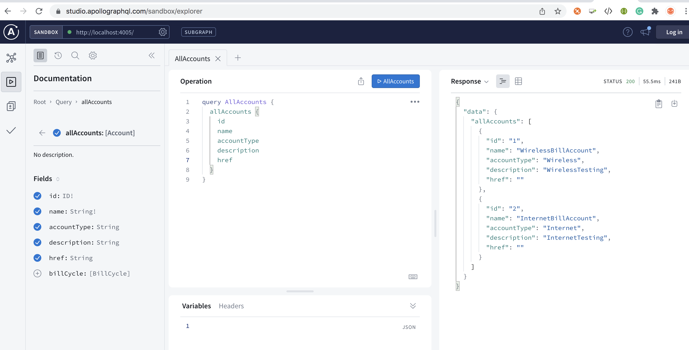
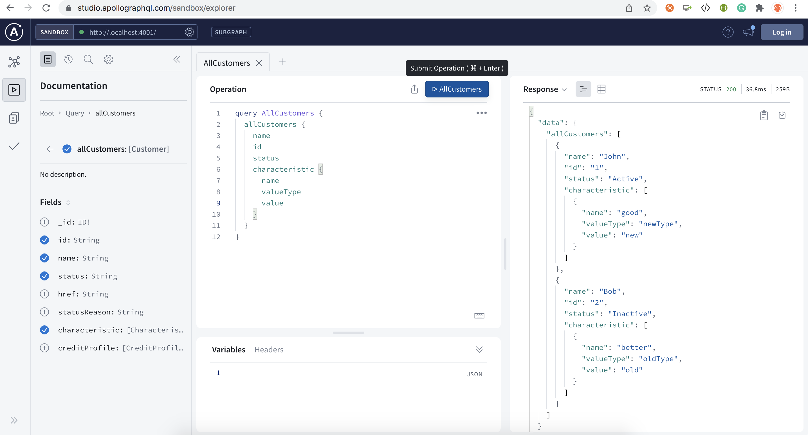
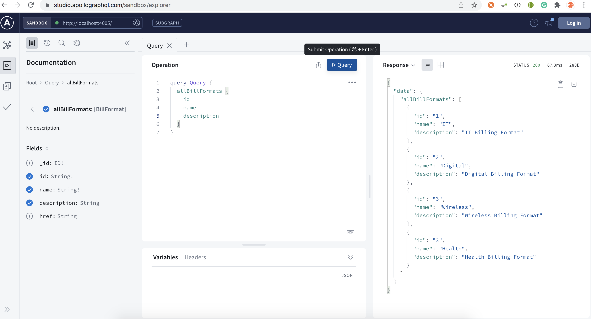
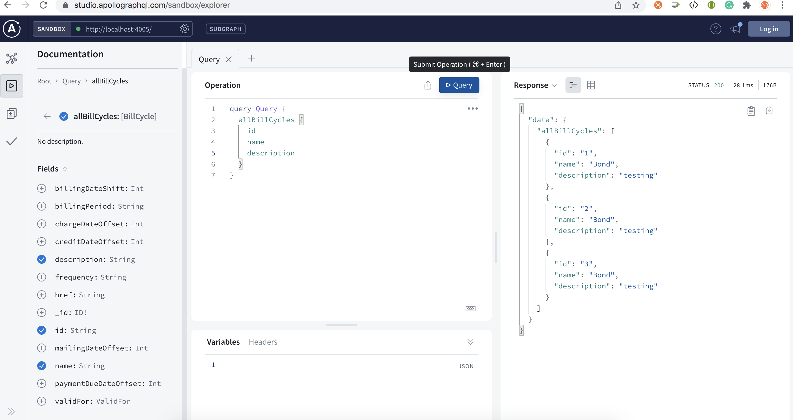
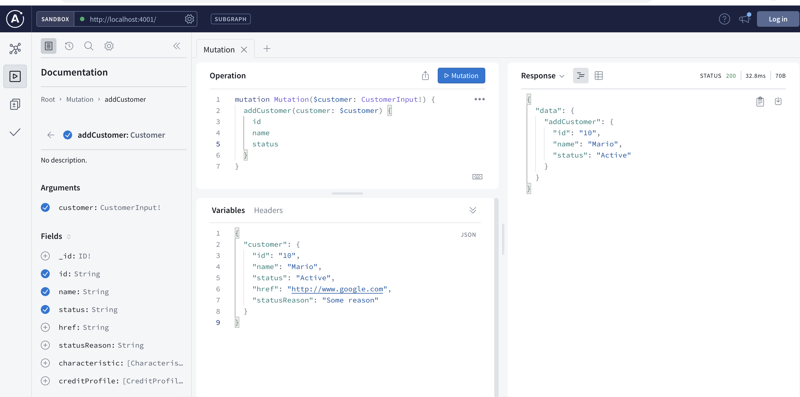
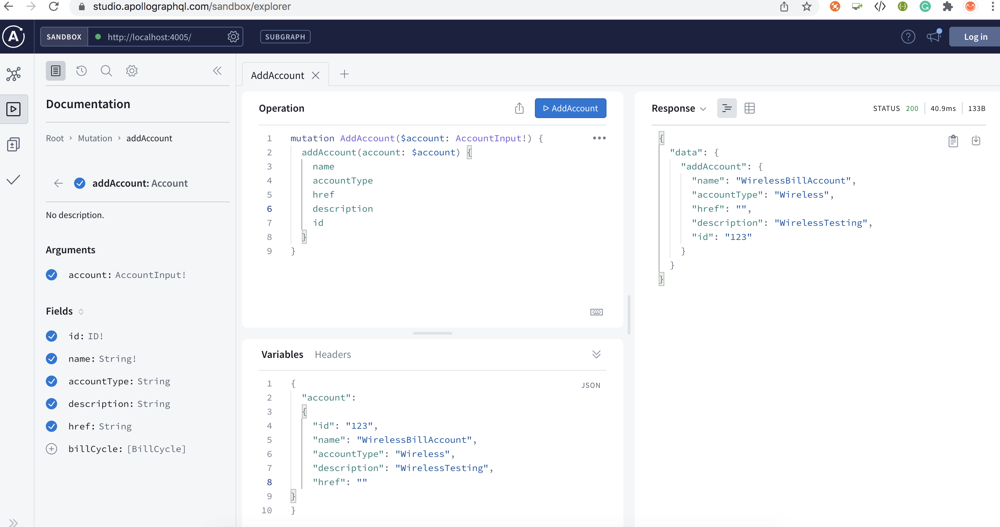
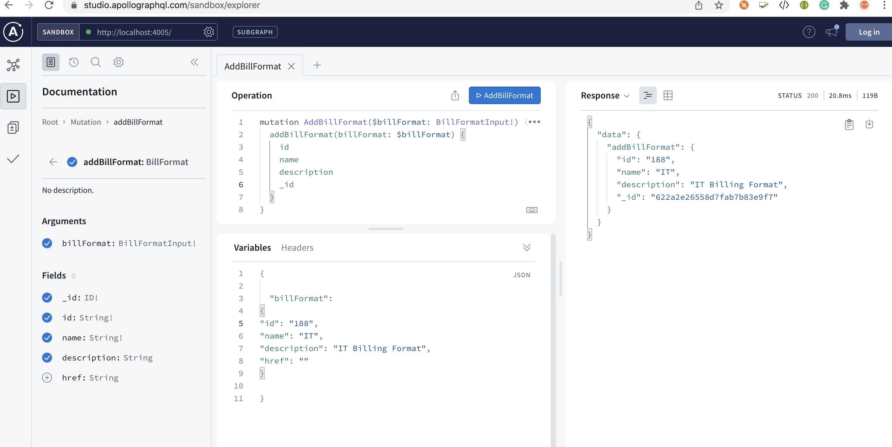
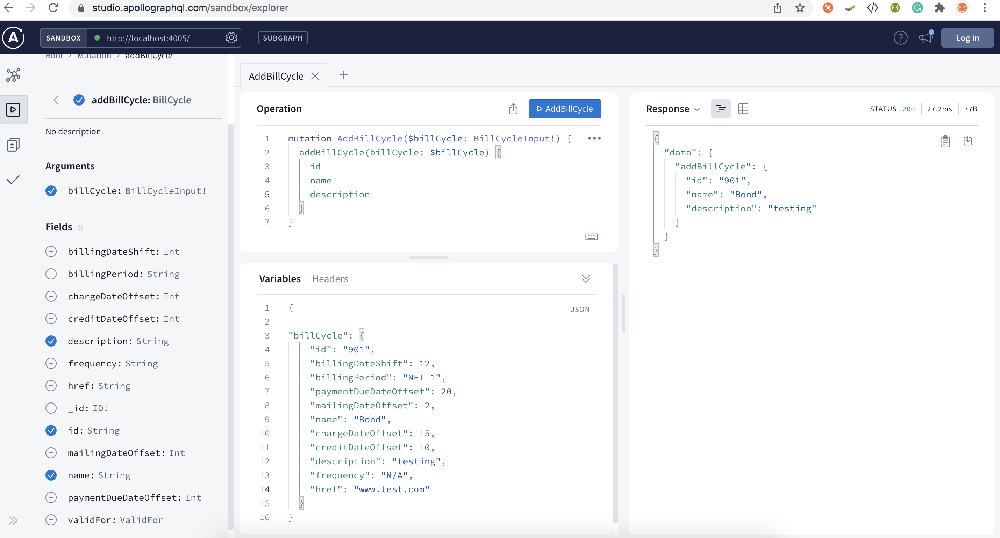
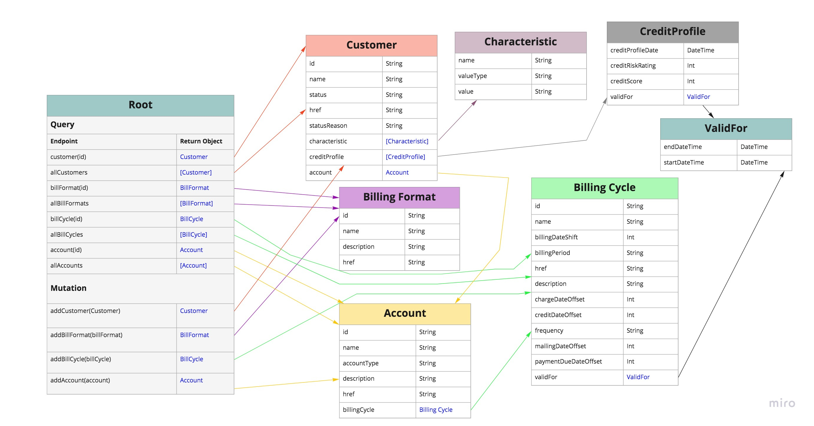

# GraphQL

## Use Case



We have 2 services

- Account
- Customer

 <b>Problem 1 </b>: We could use one service to represent both, and have one big schema to represent Account and Customer. However, this could get out of hand quite quickly and slow developers down in the future.

<b>Solution</b>: Separate these two services with their own Apollo Server along with relative schemas, resolvers, and data sources. With this approach, each service exposes its own GraphQL Server endpoints

- Account  : "http://localhost:4005"
- Customer : "http://localhost:4001"

<b>Problem 2 </b>: Each service exposes its own GraphQL Server endpoint.

<b>Solution</b>: Apollo Federation combines multiple GraphQL services and exposes a single, federated data graph. So once we have our services up and running, we use Apollo Federation to pull together all those schemas using a Gateway.

## Prerequisite

- We need three packages to get started

  - @apollo/subgraph - which makes the schemas in our services federation ready
  - @apollo/gateway - helps us to pull together our services and distribute GraphQL requests to respective services
  - apollo-server - we need an instance of Apollo Server for each service and the Gateway API

## Run Application

Once the application is up and running you can navigate to the below URL in your browser to access the application.

- Account Subgraph: "http://localhost:4005"
- Customer Subgraph: "http://localhost:4001"

- Federated Supergraph: "http://localhost:4000"

## Sample Request and Response

















## Data Model



The diagram shows all the entities used in this POC and the query and mutation endpoints exposed.

## Supergraph

## Gateway

## Account Service

This service depicts the use case of the composite model where data is coming from different data sources and aggregated together to pass to the next service

- Account
- Billing Format
- Billing Cycle

Each of these has its own Datasource(Mongo DB), Resolvers, and Schema Typedefs folders. All these models are merged together in Server.js file using "mergeResolvers" and " mergeTypeDefs"  from '@graphql-tools/merge'

For POC, sample data is fed to MongoDB through file name "pre-load.js" and data is present in file "seed.js" inside the data source structure

Once this composition is successful we should be able to retrieve the data in the below format

```code
    account (id){
            id
            name
            [
                billingCycle(id){
                    billingPerid
                    freqncy
                    [
                        billingFormat(id){
                            id
                            name

                        }
                    ]
                }
            ]
        
    }
```

## Best Practices

Listed below are the capabilities that can be referred to here:

1. Folder structure:

 For separation of concern, the folder structure is maintained for each service separately. Each service will have a separate folder for the data source, resolvers, and typeDefs. Each subgraph service will have one common file called "server.js" which is the startup point having the Appolo server, DB connection, and data loading code.
2. Error handling:
3. Unit tests
4. Integration tests
5. E2E Tests
6. Tracing & Monitoring - OpenTelemetry

## References

```link
https://www.apollographql.com/docs/apollo-server/v2/api/graphql-tools/
```

### Federation 2

```link
https://www.apollographql.com/blog/announcement/backend/announcing-federation-2/
```

- Gateway vs Router

 ```link
 https://www.apollographql.com/docs/router/ - Router
 ```

 ```link
 https://www.apollographql.com/docs/federation/gateway/
 ```

- Apollo

```link
https://www.apollographql.com/docs/federation/quickstart/
```

- federation 2

```link
https://www.apollographql.com/docs/federation/v2/
```

- Subgraphs

```link
https://www.apollographql.com/docs/federation/v2/subgraphs/
```

- Supergraph

```link
https://github.com/apollographql/supergraph-demo-fed2/blob/main/supergraph.graphql
```

- Directives

```link
https://www.apollographql.com/blog/graphql/directives/eusable-graphql-schema-directives/
```
## Complex Schema Structures

## Graphql error handeling

- https://www.apollographql.com/docs/apollo-server/v2/data/errors/#internal_server_error